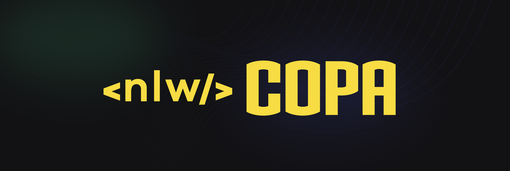
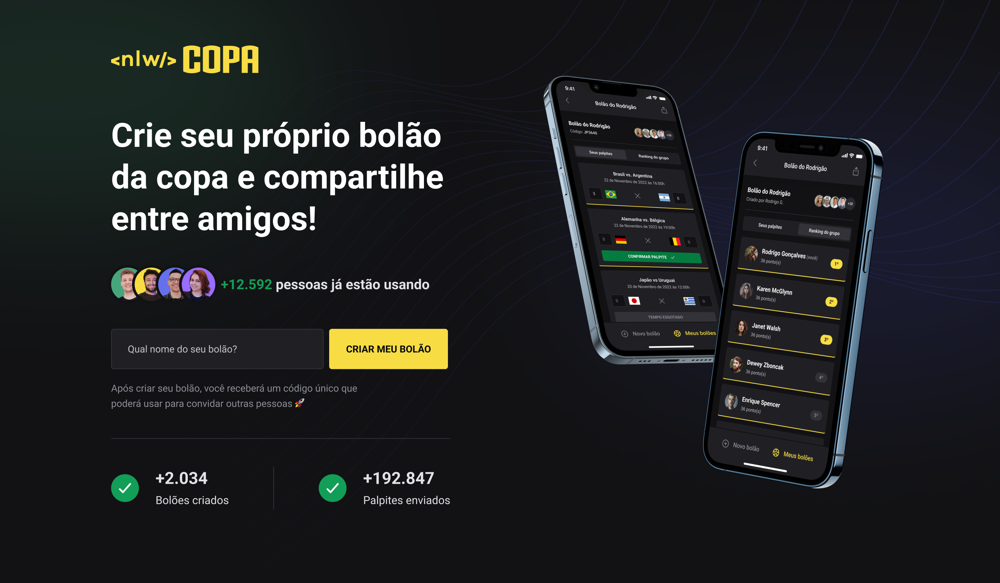
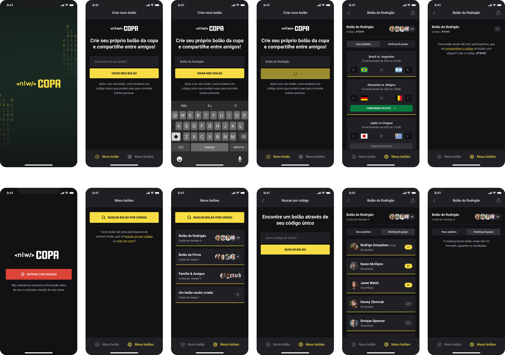

<p align="center">
  
</p>

<h1 align="center">
  Crie seu próprio bolão da copa e compartilhe entre amigos!
</h1>

<p align="center">
  <a href="https://github.com/bonizario/nlw-copa/">
    
  </a>
  <a href="https://github.com/bonizario/nlw-copa/">
    
  </a>
  <a href="https://www.linkedin.com/in/gabriel-bonizario/">
    
  </a>
  <a href="https://github.com/bonizario/nlw-copa/commits/master">
    
  </a>
  <a href="https://github.com/bonizario/nlw-copa/blob/master/LICENSE">
    
  </a>
</p>

## ⚽ Sobre

**NLW Copa** é uma plataforma que permite pessoas criarem e compartilharem bolões para os jogos da Copa de 2022!

Este projeto foi desenvolvido usando NodeJS, React e React Native, durante a última Next Level Week de 2022 ministrada pela [Rocketseat](https://rocketseat.com.br/).

<br />

## 🔌 Tecnologias

### Frontend
- [Expo](https://expo.io/)
- [React](https://reactjs.org/)
- [NextJS](https://nextjs.org/)
- [React Native](https://reactnative.dev/)
- [Tailwind CSS](https://tailwindcss.com/)
- [Typescript](https://www.typescriptlang.org/)

### Backend
- [Prisma](https://www.prisma.io/)
- [Fastify](https://www.fastify.io/)
- [NodeJS](https://nodejs.org/)
- [Typescript](https://www.typescriptlang.org/)

### Ambiente de desenvolvimento
- [VS Code](https://code.visualstudio.com/)
- [EditorConfig](https://marketplace.visualstudio.com/items?itemName=EditorConfig.EditorConfig)
- [ESLint](https://marketplace.visualstudio.com/items?itemName=dbaeumer.vscode-eslint)
- [Prettier](https://prettier.io/)

<br />

## 🎨 Layout

### Web

<p align="center">
  
</p>

### Mobile

<p align="center">
  
</p>

<br />

## 🤔 Como executar

Para clonar esse repositório pelo terminal, é necessário possuir o [Git](https://git-scm.com/) instalado em sua máquina.

```bash
# Clone o repositório
$ git clone https://github.com/bonizario/nlw-copa.git

# Entre na pasta do projeto
$ cd nlw-copa
```

Para instalar as dependências e executar o projeto, é necessário possuir o NodeJS instalado em sua máquina.
Além disso, para executar o Mobile, é necessário utilizar a plataforma Expo.

<br />

## 💭 Como contribuir

Caso queira contribuir, seja corrigindo bugs, adicionando comentários ou novas features, você pode seguir o seguinte tutorial:

- Faça um **[fork](https://help.github.com/pt/github/getting-started-with-github/fork-a-repo)** desse repositório
- **[Clone](https://help.github.com/pt/github/creating-cloning-and-archiving-repositories/cloning-a-repository)** o repositório que você fez o fork em seu computador
- Crie uma branch com a sua feature: `git checkout -b minha-alteracao`
- Envie suas alterações para a _staging area_: `git add .`
- Faça um commit contando o que você fez: `git commit -m "feat: minha nova alteracao!"`
- Faça um push para a sua branch: `git push origin minha-alteracao`
- Agora é só abrir uma _pull request_

_Caso tenha alguma dúvida, confira este [guia de como contribuir no GitHub](https://github.com/firstcontributions/first-contributions/blob/master/translations/README.pt_br.md) :)_

<br />

## 📝 License

Esse projeto está sob a licença MIT. Consulte [LICENSE](https://github.com/bonizario/nlw-copa/blob/master/LICENSE) para mais informações.

<br />

## 📮 Entre em contato

**Linkedin**: https://www.linkedin.com/in/gabriel-bonizario/

Desenvolvido por **Gabriel Bonizário** 👋🏻
